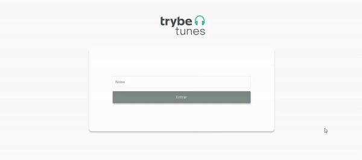
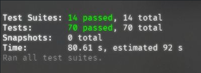

# Trybetunes

Projeto feito enquanto estudava na [Trybe](https://www.betrybe.com/), utilizando a API do iTunes, React, Class Components, Javascript e SaSS no módulo de front-end. Entregue com 100% dos requisitos.

## Instalando o Trybetunes 

Clone o repositório:
```
git clone git@github.com:matheusgb/trybetunes.git
```
Entre na pasta do repositório:
```
cd trybetunes
```
Instale as dependências:
```
npm install
```
Inicie a aplicação:
```
npm start
```

## Direitos autorais

Esse projeto foi desenvolvido por mim ([Matheus Gomes](https://www.linkedin.com/in/matheusgb/)) apenas visando o aprendizado.

